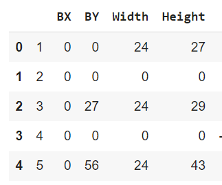

# Escherichia coli Bacteria Detection with Deep Learning(SSD Model) on Mother Machine

Figure1: A example of original image from ImageJ.

## Project Description 

To overcome the constraints of micro-colony experiments, microfluidic devices are specifically designed to spatially 
isolate and align single cells or lineages of cells. These devices contain geometrically fitting microstructures to 
restrict cells to spatially regular patterns. This geometrical restriction greatly facilitates the task of image analysis.
It is clear that segmentation accuracy directly affects cell tracking. It therefore makes sense to approach the design of 
the detection method from the point of view of drawing the bounding boxes inside dead-end channels: The microfluidic device
is simpler than the 2D micro-colonies, with key information already provided because the cells are restricted to grow in a
vertical channel. This type of structure can help to determine what methods of detection are truly useful compared to those
used to segment 2D micro-colonies. The successful detection allows later an accurate segmentation by U-Net at pixel level.
Single shot multi-box(SSD) detector is a very fast and high-accuracy object detection algorithm. SSD has no delegated region
proposal network and predicts the boundary boxes, and the classes directly from feature maps in one single pass. SSD reaches
an advanced detection level and satisfies our demands.

## Aims of the Project

This project aims to create a SSD-based framework. We will construct an adapted model based on the previous generated and
preprocessed datasets. Transformation of the bounding-box format ROI (Region of interest) into voc-dataset format is needed
in the first place. The modeling with the specific ratio of the bounding box will improve the accuracy. Fine-tuning the 
parameters is also the core work to finish this project. A developer-friendly interface is appreciated for the future project
of tracking and lineage analysis.

## Process of the Project
### 1. Data Preparation
Our data set consists of 6 stacked microscope images in total, and they are in 6 different
resolutions. With these data we have also csv files that has created ImageJ program. These 6 image's resolutions are as follows : 
(width,height,channel) data type
* (8580,256,2) 16 bit
* (11670,323,2) 16 bit
* (11370,286,2) 16 bit
* (11400,276,2) 16 bit
* (11400,283,2) 16 bit
* (11460,285,2) 16 bit
  
( You can see an example above. )

*What does the csv files contain?*

* BX: bounding box(bbox) x_1 location
* BY: bbox y_1 location
* Width : bbox width
* Height : bbox height

Figure2: A part of csv file

As seen above, besides different and huge resolutions, our images consist of 16 bit image data type and 2 channels. 
In order to adapt our existing images to the ssd300 architecture,
(You can see this process into the [utils](https://github.com/yemre-data/ecoli_bacteria_detection/blob/main/utils.py). )
1. Converted them into the RGB channel and 8 bit.
2. Unstacked them one by one we got 108 images.(6*18)
3. Cropped them to get a size of 300 by 300 and filled the missing part in the height with rgb(0,0,0)-black.
4. While cropping image, we save the bbox information in to the json file with label and difficulty attributes. 
   If the part of image does not have bbox, we 
   passed them.
5. Finally, we randomly split data as TRAIN and TEST and saving json files.

As a result, we have obtained 1752 training images and 195 test images.

   

Figure3: An example image data with bboxes.

### 2. Data transforming and load to tensor
1. First we loaded our float,long, and, byte data in to the tensor,
2. Then we performed several augmentation method which are expanding, cropping, flipping, photometric distort,
3. We normalize data with ImageNet data mean and standard deviation because we are using transfer learning weights to base conv.
   (mean = [0.485, 0.456, 0.406], std = [0.229, 0.224, 0.225])
   
I would explain here how we normalize data with mean and std. In utils.py we are using torch transform functional Normalize function 
to normalize images. Where mean and std are the mean and standard deviation of the RGB pixels and this is common to the 
ImageNet dataset.To do this first the channel mean is subtracted from each input channel and then the result is divided 
by the channel standard deviation. After this process, standard deviation of the image become 0.0 and 1.0 respectively.
Transformations are really important to success in the SSD model. It affects to learning process and computing time.

### 3. Modelling and model explanation
I will explain modeling in 5 parts. I will explain the concept of the model and what they aim with this study 
they published, and then I will try to explain what processes are in the implementation, respectively.

#### 3.1 Model concept

### 4. Training and experiments

### 5. Test results

## License
[MIT](https://choosealicense.com/licenses/mit/)